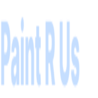

# Paint-R-Us


Website for a body shop

## _Links_:

[](https://choosealicense.com/licenses/)
[](https://shields.io/)
[](https://www.markdownguide.org/basic-syntax)

- [Github Link](https://github.com/dagreatcode/paint-r-us)

- [Website Link](https://www.paint-r-us.com/)

## Index

- [Installation](#installation)
- [Usage](#usage)
- [User Story](#user-story)
- [Acceptance Criteria](#acceptance-criteria)
- [Credits](#credits)
- [License](#license)
- [Badges](#badges)
- [Features](#features)
- [Contributing](#contributing)
- [Test](#tests)
- [Wire-Frame](#wire-frame)
- [Updates](#updates)
- [Review](#review)
- [Project Links](#project-links)
- [Connect with Me](#conecct-with-me)

# Installation

## Downloading in the browser.

- [Download the Paint R Us App](https://paint-r-us.onrender.com)
  There is a install indicator in the browser bar. Mobile user like IOS can click the send icon and then click ADD TO HOMEPAGE.

## Downloading this Code

- [Download the Paint R Us Code](https://github.com/dagreatcode/paint-r-us)
  After installing, Change the database to a database you can access in the server.js file. Create a .env file and add the database string to connect the app to the database in the .env file. Example: MONGODB_URI=mongodb+srv:[with the rest of the string here].
  After adding the MongoDB database string to your .env file, run **npm install** in your terminal, making sure you are in the same folder as the server.js file.
  After installing the packages for the app to run, run **npm run** build.
  After the build is done, run **npm start**.

# Usage

Provide instructions and examples for use. Include screenshots as needed.

# User Story

```md
AS A User,
I WANT a Business Site
SO THAT customers can make appointments and get in contact with us for car services.
Also find the location to show up and get a solid quote.
```

# Acceptance Criteria

```
GIVEN a
WHEN I
I WANT
THEN I
```

# Credits

First Credits go to Georgia Institute of Technology Collage. I have Learned a lot and understand the structure and the objective of the course. The approve is understood and glad to be a Yellow Jacket.

http://lordicon.com
https://ethereal.email
---

# License

```
MIT License

Copyright (c) 2022 Vincent Kendrick

Permission is hereby granted, free of charge, to any person obtaining a copy
of this software and associated documentation files (the "Software"), to deal
in the Software without restriction, including without limitation the rights
to use, copy, modify, merge, publish, distribute, sublicense, and/or sell
copies of the Software, and to permit persons to whom the Software is
furnished to do so, subject to the following conditions:

The above copyright notice and this permission notice shall be included in all
copies or substantial portions of the Software.

THE SOFTWARE IS PROVIDED "AS IS", WITHOUT WARRANTY OF ANY KIND, EXPRESS OR
IMPLIED, INCLUDING BUT NOT LIMITED TO THE WARRANTIES OF MERCHANTABILITY,
FITNESS FOR A PARTICULAR PURPOSE AND NONINFRINGEMENT. IN NO EVENT SHALL THE
AUTHORS OR COPYRIGHT HOLDERS BE LIABLE FOR ANY CLAIM, DAMAGES OR OTHER
LIABILITY, WHETHER IN AN ACTION OF CONTRACT, TORT OR OTHERWISE, ARISING FROM,
OUT OF OR IN CONNECTION WITH THE SOFTWARE OR THE USE OR OTHER DEALINGS IN THE
SOFTWARE.
```

# Badges


🏆

# Features

What makes your project stand out?

[](code_of_conduct.md)

# Contributing

When contributing to this repository, please first discuss the change you wish to make via issue, email
If you created an application or package and would like other developers to contribute it, you will want to add guidelines for how to do so. The [Contributor Covenant](https://www.contributor-covenant.org/) is an industry standard, but you can always write your own.

# Tests

Go the extra mile and write tests for your application. Then provide examples on how to run them.

# Wire-Frame

```
https://www.figma.com/file/PLO3yeIYcn8biC5OrbIIlO/Untitled?node-id=0%3A3&t=MPiwoVdVFkm6owjJ-0
```

# Updates

```
We are in 1.0
We are already working on 2.0 ideas, but version 1 is almost done and stable.
```

# Review

```
I have learned a lot by doing this portfolio. SEO needs to be awesome
```

# Project Links

- [The URL](https://www.paint-r-us.com/)

- [The URL of the GitHub repository](https://github.com/dagreatcode/paint-r-us)

- [Task Dashboard](https://trello.com/)

https://paint-r-us.onrender.com

https://ethereal.email/login
https://ethereal.email/messages
https://ethereal.email/create

### Connect with me

[][website]
[][linkedin]
[][twitter]
[][youtube]
<br/>

[website]: http://paint-r-us.onrender.com/
[medium]: https://medium.com/@
[kaggle]: https://www.kaggle.com/
[codechef]: http://codechef.com/users/
[linkedin]: https://www.linkedin.com/
[twitter]: https://twitter.com/
[youtube]: https://www.youtube.com/
[link]: https://xd.adobe.com/
[javascript]: https://www.javascript.com/
[react]: https://reactjs.org/
[express]: https://expressjs.com/
[node]: https://nodejs.org/en/
[mysql]: https://www.mysql.com/
[mongodb]: https://www.mongodb.com/
[svg]: https://www.svgdesigns.com/
[vscode]: https://code.visualstudio.com/
[git]: https://git-scm.com/
[github]: https://github.com/

## [terminal]: http://www.vincentkendrick.com/

© 2022 DaGreat Code LLC. All Rights Reserved.
